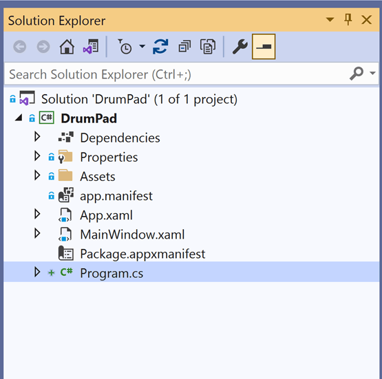

# Making the app single-instanced

Single-instanced apps only allow one instance of the app running at a time. WinUI apps are multi-instanced by default. They allow you to launch multiple instances of the same app at one time, which we call multiple instances. However, you may implement single-instancing based on the use case of your app. Attempting to launch a second instance of a single-instanced app will only result in the first instance’s main window being activated instead. This tutorial demonstrates how to implement single-instancing.

In this blog
1.	Disable app build
2.	Define customized MAIN method for redirection
3.	Test single-instancing via app deployment

## Disable app build
We need to check for redirection as early as possible, and before creating any windows. To do this, we must define the symbol "DISABLE_XAML_GENERATED_MAIN" in the project build properties.

1.	Double-click on the project name in Solution Explorer: 
 

2.	Define the **DISABLE_XAML_GENERATED_MAIN** symbol below \</PropertyGroup>
```xml
<PropertyGroup Condition="'$(Configuration)|$(Platform)'=='Debug|x64'">
  <DefineConstants>DISABLE_XAML_GENERATED_MAIN</DefineConstants>
</PropertyGroup>
<PropertyGroup Condition="'$(Configuration)|$(Platform)'=='Debug|x86'">
  <DefineConstants>DISABLE_XAML_GENERATED_MAIN</DefineConstants>
</PropertyGroup>
<PropertyGroup Condition="'$(Configuration)|$(Platform)'=='Release|x86'">
  <DefineConstants>DISABLE_XAML_GENERATED_MAIN</DefineConstants>
</PropertyGroup>
<PropertyGroup Condition="'$(Configuration)|$(Platform)'=='Release|x64'">
  <DefineConstants>DISABLE_XAML_GENERATED_MAIN</DefineConstants>
</PropertyGroup>
<PropertyGroup Condition="'$(Configuration)|$(Platform)'=='Debug|arm64'">
  <DefineConstants>DISABLE_XAML_GENERATED_MAIN</DefineConstants>
</PropertyGroup>
<PropertyGroup Condition="'$(Configuration)|$(Platform)'=='Release|arm64'">
  <DefineConstants>DISABLE_XAML_GENERATED_MAIN</DefineConstants>
</PropertyGroup>
```


### Define a customized Program class with a Main method

A customized Program.cs file is created instead of running the default Main method because it enables the app to check for redirection, which is not what WinUI apps default to doing.
 
1.	Navigate to Solution Explorer -> **Right-click** on the project name -> **Add** -> **New Item** 
2.	Under **Visual C# Items** -> **Code** -> **Class** -> Name it **Program.cs** -> **Add**

> **NOTE**: Your project should look like this:
<p align="center">

</p>
 
3.	Add the following namespaces:

##### Program.cs:

```csharp
using System.Threading;
using Microsoft.UI.Dispatching;
using Microsoft.Windows.AppLifecycle;
using Windows.ApplicationModel.Activation;
using Windows.Storage;
```


4.	Replace the empty class Program with following:

##### Program.cs:

```csharp
class Program
{
    [STAThread]
    static async Task<int> Main(string[] args)
    {
        WinRT.ComWrappersSupport.InitializeComWrappers();
        bool isRedirect = await DecideRedirection();
        if (!isRedirect)
        {
            Microsoft.UI.Xaml.Application.Start((p) =>
            {
                var context = new DispatcherQueueSynchronizationContext(
                    DispatcherQueue.GetForCurrentThread());
                SynchronizationContext.SetSynchronizationContext(context);
                new App();
            });
        }

        return 0;
    }
}
```

> **NOTE**: Main determines if it should redirect or launch a new app instance via DecideRedirection();

5.	Define DecideRedirection() below the Main method:

##### Program.cs:

```csharp
private static async Task<bool> DecideRedirection()
{
    bool isRedirect = false;

    AppActivationArguments args = AppInstance.GetCurrent().GetActivatedEventArgs();
    ExtendedActivationKind kind = args.Kind;

    try
    {
        AppInstance keyInstance = AppInstance.FindOrRegisterForKey("randomKey");

        if (keyInstance.IsCurrent)
        {
            keyInstance.Activated += OnActivated;
        }
        else
        {
            isRedirect = true;
            await keyInstance.RedirectActivationToAsync(args);
        }
    }

    catch (Exception ex)
    {

    }

    return isRedirect;
}
```

> **NOTE**: DecideRedirection determines if the app has been registered via a registry key. Based on the success of registering the app again with the same registry key, it infers if there is a current app instancing running; therefore, whether or not to redirect or allow the app to launch for the first time

6.	Define the helper function OnActivated

##### Program.cs:

```csharp
private static void OnActivated(object sender, AppActivationArguments args)
{
    ExtendedActivationKind kind = args.Kind;

}
```

## Testing single-instancing via app deployment

Up until now, we have been testing our app by running the solution debugger. We can only have one debugger running at once. Therefore, it prevents us from knowing whether the app is single-instanced because we can’t debug the same project solution twice at the same time. To test, we will deploy the application. After deploying, we can launch the app from the desktop like how you would with Microsoft Word. 

1.	Navigate to Solution Explorer -> **Right-click** on the project name -> **Deploy**
2.	Open the start menu and click on the search field
3.	Type "DrumPad" (or your app’s name) in the search field 
4.	Click on the app icon from the search result to launch the app
5.	Repeat steps 2 to 4 to launch the same app again and see if another instance pops up

## Next Steps

**Don't stop learning!** Now that you have the basic app built, you can easily add other controls from the WinUI 3 Controls Gallery and experiment other cool WinAppSDK features to enhance your Windows apps!
Here are some links to check out with resources on building for WinUI 3 apps with WinAppSDK: 
* [Official WinAppSDK GitHub Repo](https://github.com/microsoft/WindowsAppSDK)
* [Windows UI Library 3](https://docs.microsoft.com/en-us/windows/apps/winui/winui3/)
* [WinAppSDK Samples](https://github.com/microsoft/WindowsAppSDK-Samples)
* [WinUI 3 Samples](https://github.com/microsoft/WinUI-3-Demos)

All the code we have covered from this blog post series is on my repository on [GitHub](https://github.com/jingwei-a-zhang/DrumPad), with branches for the different steps. The main branch is the most comprehensive. Those branches will allow you to see how the app architecture evolved.